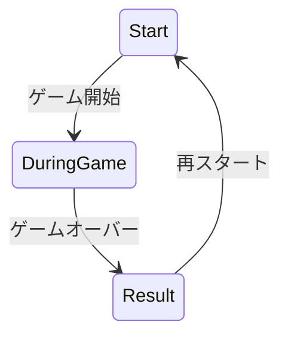
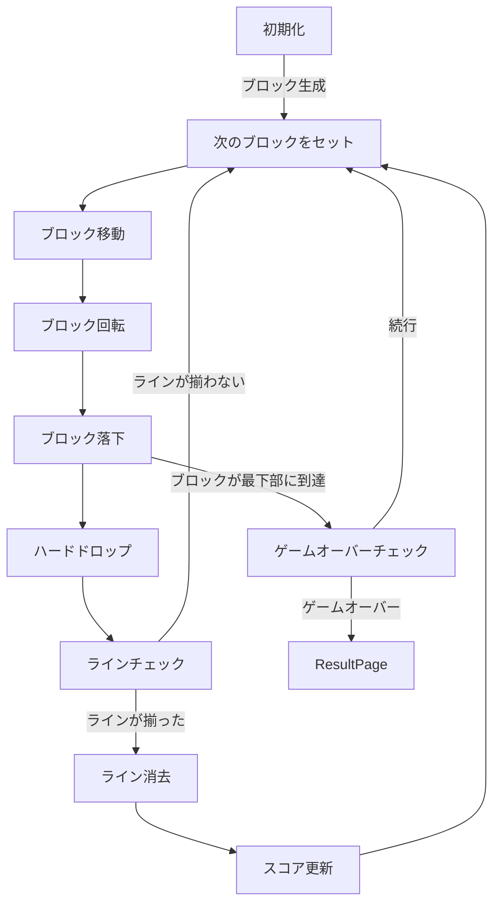

## Stack

- Next.js14 系（app router）
  - React
  - TypeScript
- Mantine

## Getting Started

事前の設定は特に不要で、下記コマンドのみです。
node.js のバージョンは、18.18.2 で開発しています。

```bash
yarn
yarn dev
```

## 要件定義

### 概要

7 種類のテトリミノがフィールド上部からランダムに 1 つずつ落下してきます．
テトリミノを操作しフィールドに敷き詰めると，揃った横一列が消去されます．
より長い時間，プレイを続けることを目指すゲームです．

### 基本ルール

#### フィールド

- 縦 20 行
- 横 14 列

#### ミノ

- 左に 90 度に回転できる
- 左右に移動できる
- 直下に急速に落下させるハードドロップも使用できる
- 種類
  - I
  - O
  - T
  - S
  - Z
  - J
  - L

#### ゴーストミノ

- 落下地点を示す透明なミノが表示され、配置位置の予測を助けます。

#### NEXT 表示

- 次に出現するミノを表示

#### 操作の種類

- ←: テトリミノを左に移動
- →: テトリミノを右に移動
- ↑: テトリミノをハードドロップ
- ↓: テトリミノを下に移動
- space: テトリミノを左回転

## 設計

### 概要

オブジェクト指向ではなくて、コンポーネント指向で設計している。

### ページ

1. ゲームスタート（start）：ゲーム開始ボタンを設置
1. ゲーム中（game-playing）：ゲームプレイのみ。keyboard と button で操作する
1. リザルト（result）: 結果を表示、ゲームスタートへ戻るボタン

### 画面遷移図



### 処理の流れ


